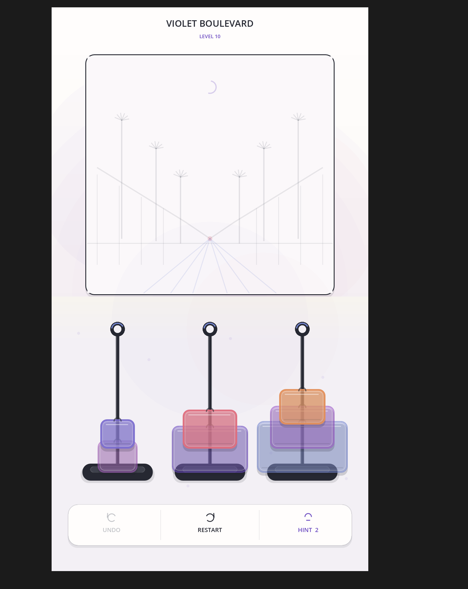
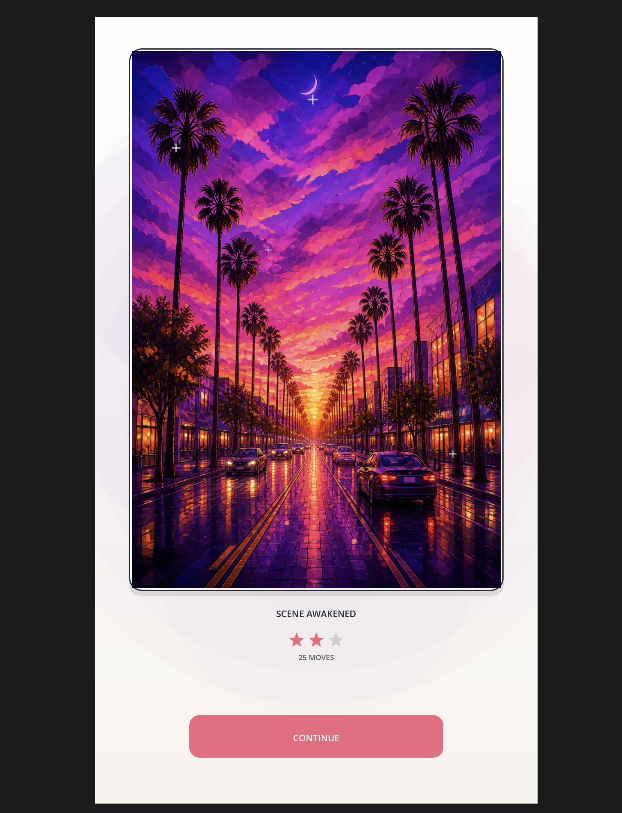

# Layered Light

**A portrait mobile puzzle game about restoring hidden scenes through size-order sorting.**

> Active prototype development and Android device testing. Not yet commercially released.

## Project overview

Layered Light is a calm, tactile puzzle game in which players move translucent panes between stands, free them in size order, and gradually awaken a concealed illustration. The opening preserves curiosity through a faint scene outline, while each successful move adds colour and detail until the final visual reward is revealed.

## My contribution

I am the **solo developer and product owner**, responsible for the original concept, puzzle mechanics, level progression, visual direction, interaction design, playtesting, and quality decisions. I work iteratively with **OpenAI Codex as an AI development partner** for rapid prototyping, GDScript implementation, debugging, automated checks, Android configuration, and technical refinement. I review every build, test it on a physical device, provide visual and usability feedback, and make the final product decisions.

## Work completed so far

- Designed and implemented the size-order stacking mechanic with forgiving mobile tap targets.
- Built 10 solvable levels with increasing complexity.
- Added hints, undo, restart, scoring, saved progression, completion states, and unlocked-level replay.
- Developed progressive scene restoration so the finished artwork is not revealed at the start.
- Iterated through multiple visual systems based on side-by-side design review and real-device feedback.
- Added adaptive portrait layouts and Android touch support.
- Configured Android Studio, the Android SDK, Godot export templates, APK generation, ADB deployment, and physical-device testing on a OnePlus 9RT.
- Created automated smoke tests covering all 10 level solutions, theme data, scoring, and completion behavior.

## Technology and workflow

**Godot 4.7 · GDScript · Android Studio · Android SDK · ADB · Git · GitHub · OpenAI Codex**

The workflow combines AI-assisted implementation with human-led product judgment: I define the experience, test builds, identify gameplay and visual gaps, prioritize fixes, and validate changes on desktop and Android hardware.

## Current focus

The core gameplay loop and Android testing pipeline are functional. Current work focuses on mobile UI refinement, navigation, visual consistency, typography, screen-fit behavior, and broader device QA.

## Demo availability

An interactive Android prototype is available on request. The full source repository remains private while the game is in development.

---

© 2026 Abhishek Singh. All rights reserved. This repository is a portfolio showcase; source code and production assets are not distributed here.
